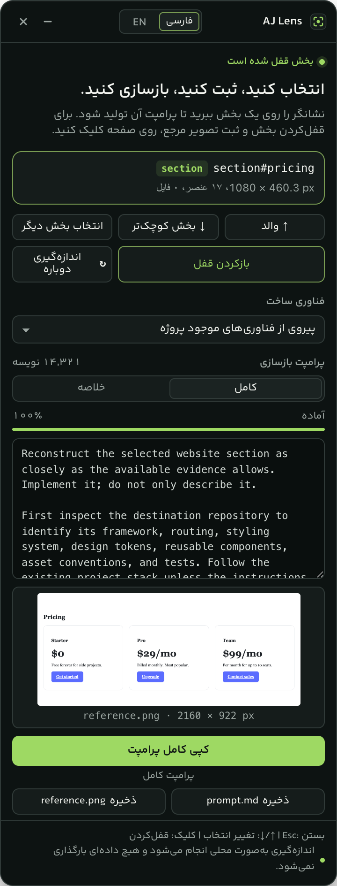
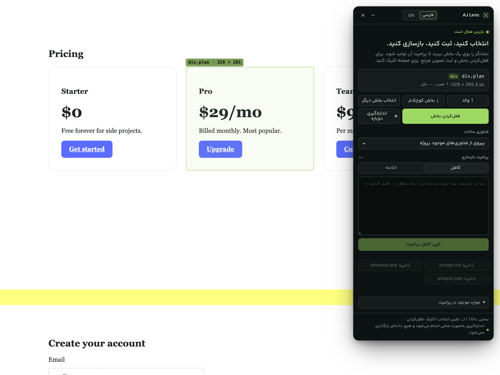
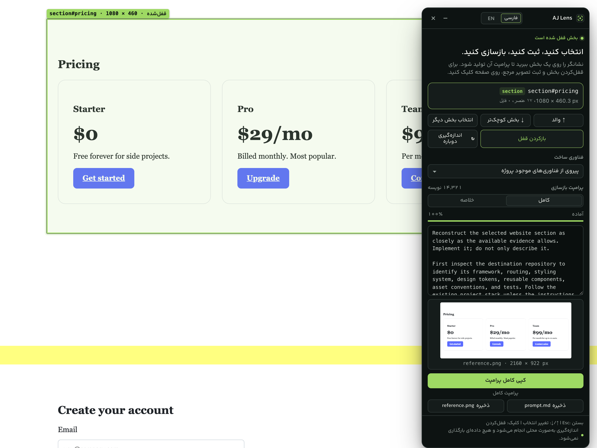
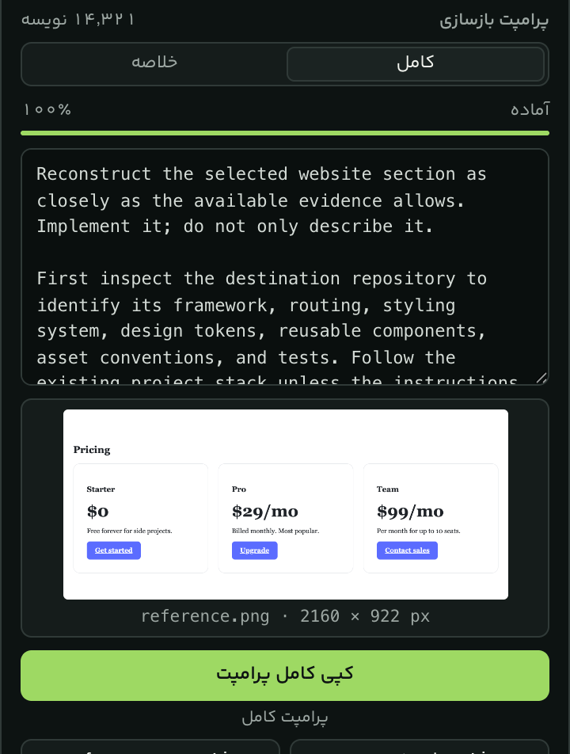
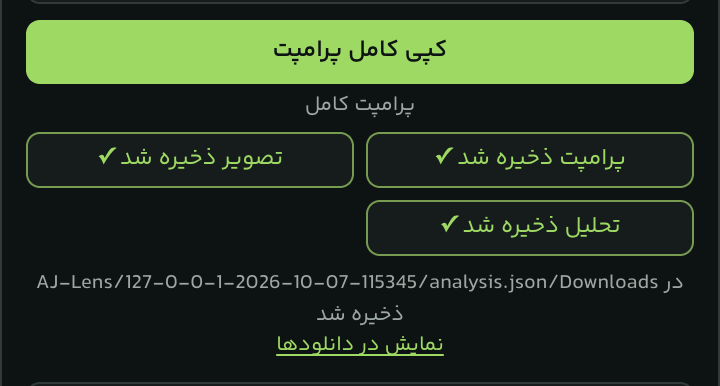
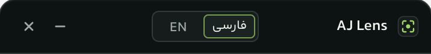

<div dir="rtl">

# AJ Lens

**انتخاب کنید، ثبت کنید، بازسازی کنید.**

AJ Lens یک افزونه Chrome (Manifest V3) است که به شما اجازه می‌دهد یک بخش از هر صفحه وب را انتخاب کنید، ساختار DOM و ویژگی‌های بصری آن را بررسی کنید، یک تصویر مرجع از همان بخش بگیرید و یک پرامپت دقیق برای بازسازی آن بسازید. این پرامپت برای ابزارهای کدنویسی هوشمند قابل استفاده است.

- رابط کاربری افزونه به‌طور پیش‌فرض **فارسی** و راست‌به‌چپ است.
- رابط **انگلیسی** هم در دسترس است و از سربرگ پنل انتخاب می‌شود.
- پرامپت‌های بازسازی و فایل‌های خروجی همیشه **انگلیسی** هستند.
- همه تحلیل‌ها **به‌صورت محلی** در مرورگر شما انجام می‌شوند.
- هیچ محتوایی از وب‌سایت **بارگذاری یا ارسال نمی‌شود**. افزونه سرور، کلید API یا حساب کاربری ندارد.



## فهرست

- [قابلیت‌ها](#قابلیتها)
- [تصاویر](#تصاویر)
- [نصب از سورس](#نصب-از-سورس)
- [نحوه استفاده](#نحوه-استفاده)
- [فایل‌های خروجی](#فایلهای-خروجی)
- [میانبرهای صفحه‌کلید](#میانبرهای-صفحهکلید)
- [مجوزهای Chrome](#مجوزهای-chrome)
- [حریم خصوصی](#حریم-خصوصی)
- [محدودیت‌ها](#محدودیتها)
- [فرمان‌های توسعه](#فرمانهای-توسعه)
- [ساختار پروژه](#ساختار-پروژه)
- [تست و کیفیت](#تست-و-کیفیت)
- [مستندات بیشتر](#مستندات-بیشتر)
- [مشارکت](#مشارکت)
- [مجوز نرم‌افزار](#مجوز-نرمافزار)

## قابلیت‌ها

**انتخاب بخش**

- **فعال‌سازی بازرس** با کلیک روی آیکون نوار ابزار یا میانبر <bdi dir="ltr">`Alt+Shift+S`</bdi>.
- **برجسته‌سازی هنگام عبور نشانگر:** یک کادر سبز همراه نشانگر حرکت می‌کند و برچسب تگ، انتخابگر و ابعاد را نشان می‌دهد.
- **انتخاب ناحیه معنادار:** به‌جای عمیق‌ترین `span` یا آیکون، نزدیک‌ترین بخش معنادار (section، کارت، گرید، فرم، nav) انتخاب می‌شود. یک تأخیر کوتاه (hysteresis) از پرش انتخاب جلوگیری می‌کند.
- **انتخاب والد** (↑ والد) و **انتخاب بخش کوچک‌تر** (↓ بخش کوچک‌تر) با دکمه یا کلیدهای جهت‌نما.
- **قفل‌کردن بخش** با کلیک روی صفحه، دکمه «قفل‌کردن بخش» یا کلید Enter.

**تحلیل**

- **تحلیل DOM:** ساختار، تعداد عناصر، عمق و خلاصه درخت.
- **تحلیل Computed Style:** فقط ویژگی‌های مؤثر در بازسازی، با حذف مقادیر پیش‌فرض و ارثی.
- **چیدمان:** flex، grid، فاصله‌ها، ابعاد و موقعیت‌ها.
- **تایپوگرافی:** خانواده فونت، اندازه، وزن، ارتفاع خط و فاصله حروف.
- **رنگ‌ها و توکن‌ها:** استخراج پالت، متغیرهای CSS (custom properties) و کنتراست.
- **تشخیص دارایی‌ها:** تصاویر، `picture`/`srcset`، SVG، پس‌زمینه‌ها، ویدیو و canvas.
- **دسترس‌پذیری:** نقش‌ها، ویژگی‌های ARIA، برچسب‌ها و ساختار سرتیترها.
- **شواهد واکنش‌گرا (Responsive):** media queryهای مرتبط از stylesheetهای قابل‌خواندن.
- **تعامل‌ها:** عناصر تعاملی موجود در بخش (بدون کلیک یا تغییر صفحه).
- **دسته‌بندی بخش:** تشخیص قطعی و اکتشافی نوع بخش (مثلاً hero، pricing، فرم) همراه با میزان اطمینان و شواهد.

**تصویر و پرامپت**

- **ثبت تصویر مرجع:** گرفتن تصویر از ناحیه قابل‌مشاهده تب و برش دقیق آن به اندازه بخش، با درنظرگرفتن devicePixelRatio و بزرگ‌نمایی مرورگر. پنل و کادر برجسته‌سازی در تصویر دیده نمی‌شوند.
- **پرامپت کامل (Detailed)** و **پرامپت خلاصه (Compact)** با بودجه اندازه مشخص.
- انتخاب **فناوری ساخت:** پیروی از فناوری پروژه، React، Next.js، Vue، Nuxt، Svelte، Astro، HTML/CSS/JS، Tailwind CSS یا دستورالعمل سفارشی.
- انتخاب مواردی که در پرامپت گنجانده شوند (متن قابل‌مشاهده، آدرس دارایی‌ها، خلاصه DOM، شواهد CSS و …).
- **کپی کامل پرامپت با یک کلیک:** همیشه کل پرامپت حالت انتخاب‌شده کپی می‌شود، نه فقط بخش قابل‌مشاهده در کادر متن.
- **ذخیره `reference.png`**، **ذخیره `prompt.md`** و **ذخیره `analysis.json`** در پوشه Downloads.

**رابط کاربری و حریم خصوصی**

- رابط **فارسی** (پیش‌فرض) و **انگلیسی** با انتخابگر فشرده در سربرگ پنل.
- **میانبرهای صفحه‌کلید** برای همه کارهای اصلی.
- پنل در Shadow DOM جداگانه اجرا می‌شود؛ قابل جابه‌جایی و کوچک‌سازی است و موقعیتش ذخیره می‌شود.
- **حریم خصوصی محلی:** بدون درخواست شبکه، بدون analytics و بدون ذخیره محتوای صفحه.

## تصاویر

همه تصاویر از رابط واقعی AJ Lens روی صفحه نمونه تست (`tests/fixtures/landing.html`) گرفته شده‌اند و هیچ داده شخصی ندارند.

| برجسته‌سازی بخش هنگام عبور نشانگر                                                    | بخش قفل‌شده و تحلیل کامل                                                          |
| ------------------------------------------------------------------------------------ | --------------------------------------------------------------------------------- |
|  |  |

| پرامپت انگلیسی بازسازی در پنل فارسی                                                                 | دکمه‌های ذخیره خروجی                                                                                        |
| --------------------------------------------------------------------------------------------------- | ----------------------------------------------------------------------------------------------------------- |
|  |  |

انتخابگر زبان در سربرگ پنل:



## نصب از سورس

پیش‌نیازها: Node.js و npm، و Chrome نسخه 127 یا جدیدتر (یا مرورگر Chromium دیگری که از Manifest V3 پشتیبانی کند).

</div>

```bash
git clone https://github.com/hamid19471/JALens-Extension.git
cd JALens-Extension
npm install
npm run build
```

<div dir="rtl">

خروجی ساخت در پوشه `dist/` قرار می‌گیرد. سپس:

1. صفحه `chrome://extensions` را باز کنید.
2. **Developer mode** را در گوشه بالا فعال کنید.
3. روی **Load unpacked** کلیک کنید.
4. پوشه `dist` ساخته‌شده را انتخاب کنید.
5. از منوی افزونه‌ها (آیکون پازل)، AJ Lens را به نوار ابزار سنجاق (Pin) کنید.

**پس از هر ساخت دوباره:** Chrome افزونه‌های unpacked را خودکار بارگذاری نمی‌کند. در `chrome://extensions` روی دکمه **Reload** افزونه AJ Lens کلیک کنید و سپس صفحه وب موردنظر را هم تازه‌سازی کنید.

فرمان `npm run package` یک فایل ZIP در مسیر `release/aj-lens-1.0.0.zip` می‌سازد. برای استفاده، آن را از حالت فشرده خارج کنید و پوشه حاصل را به همان روش Load unpacked بارگذاری کنید.

## نحوه استفاده

1. یک وب‌سایت معمولی (`http` یا `https`) را باز کنید.
2. روی آیکون AJ Lens در نوار ابزار کلیک کنید یا <bdi dir="ltr">`Alt+Shift+S`</bdi> را بزنید. پنل در گوشه بالای صفحه باز می‌شود.
3. نشانگر را روی بخش‌های صفحه حرکت دهید. کادر سبز بخش معنادار زیر نشانگر را نشان می‌دهد و پنل تگ، انتخابگر، ابعاد، تعداد عناصر و تعداد فایل‌ها را نمایش می‌دهد.
4. در صورت نیاز با **↑ والد** یا **↓ بخش کوچک‌تر** (یا کلیدهای جهت‌نما) انتخاب را دقیق کنید.
5. روی صفحه کلیک کنید یا **قفل‌کردن بخش** (یا Enter) را بزنید.
6. صبر کنید تا تحلیل مرحله‌به‌مرحله کامل شود. نوار پیشرفت مراحل را نشان می‌دهد. اگر بخش فقط تا حدی در صفحه دیده شود، می‌توانید «ثبت بخش قابل مشاهده»، «نمایش کامل بخش و ثبت تصویر» یا «انصراف» را انتخاب کنید.
7. فناوری ساخت و حالت **کامل** یا **خلاصه** را انتخاب کنید. سپس **کپی کامل پرامپت** را بزنید یا سه فایل خروجی را ذخیره کنید.
8. فایل‌های `prompt.md` و `reference.png` (و در صورت نیاز `analysis.json`) را به ابزار کدنویسی هوشمند موردنظرتان بدهید.

برای ادامه کار، **بازکردن قفل** یا **انتخاب بخش دیگر** را بزنید.

راهنمای کامل‌تر: [docs/USAGE.fa.md](docs/USAGE.fa.md)

## فایل‌های خروجی

هر دکمه ذخیره یک فایل را از طریق Downloads API کروم در **یک پوشه مشترک برای هر بخش قفل‌شده** ذخیره می‌کند:

</div>

```text
Downloads/AJ-Lens/<hostname>-<YYYY-MM-DD-HHmmss>/
├── reference.png
├── prompt.md
└── analysis.json
```

<div dir="rtl">

| فایل            | محتوا                                                                                                                                                      |
| --------------- | ---------------------------------------------------------------------------------------------------------------------------------------------------------- |
| `reference.png` | تصویر برش‌خورده بخش انتخاب‌شده با وضوح کامل دستگاه. پنل و کادر برجسته‌سازی در آن نیستند.                                                                   |
| `prompt.md`     | اطلاعات ثبت (آدرس پاک‌سازی‌شده، زمان، ابعاد)، کل پرامپت بازسازی در حالت فعلی (کامل یا خلاصه) و پیوست پاک‌سازی‌شده.                                         |
| `analysis.json` | تحلیل ساختاریافته و نسخه‌دار (`schemaVersion: "1.0"`) شامل ساختار، استایل‌ها، رنگ‌ها، تایپوگرافی، دارایی‌ها و دسته‌بندی؛ با فرمت UTF-8 و تورفتگی دو فاصله. |

- نام پوشه از نام میزبان صفحه (فقط حروف و اعداد انگلیسی، `-` و `_`) و زمان ثبت به وقت محلی ساخته می‌شود.
- مسیر همیشه نسبت به **پوشه Downloads تنظیم‌شده در Chrome** است. AJ Lens هرگز خارج از آن یا با مسیر مطلق ذخیره نمی‌کند.
- فایل‌ها هرگز بازنویسی نمی‌شوند؛ ذخیره دوباره نامی مانند `prompt (1).md` می‌سازد.
- اگر گزینه «پرسیدن محل ذخیره هر فایل» در Chrome فعال باشد، مرورگر ممکن است محل ذخیره را بپرسد. افزونه‌ها نمی‌توانند این تنظیم را دور بزنند.
- پس از ذخیره موفق، پیوند **نمایش در دانلودها** در پنل نمایش داده می‌شود.

## میانبرهای صفحه‌کلید

| کلید                               | عملکرد                                                                     |
| ---------------------------------- | -------------------------------------------------------------------------- |
| <bdi dir="ltr">`Alt+Shift+S`</bdi> | فعال یا غیرفعال‌کردن بازرس (قابل تغییر در `chrome://extensions/shortcuts`) |
| `Esc`                              | بستن بازرس (یا لغو انتخاب نحوه ثبت تصویر)                                  |
| `↑`                                | انتخاب نزدیک‌ترین والد معنادار                                             |
| `↓`                                | انتخاب معنادارترین فرزند (در صورت امکان همان که زیر نشانگر است)            |
| `Enter`                            | قفل‌کردن انتخاب فعلی                                                       |
| `R`                                | اندازه‌گیری دوباره (در حالت قفل، تحلیل دوباره)                             |
| `C`                                | کپی پرامپت (پس از قفل‌کردن)                                                |

هنگام تایپ در فیلدهای ورودی، textarea، select یا عناصر contenteditable، میانبرها نادیده گرفته می‌شوند.

## مجوزهای Chrome

| مجوز        | دلیل نیاز                                                                                                                                                                     |
| ----------- | ----------------------------------------------------------------------------------------------------------------------------------------------------------------------------- |
| `activeTab` | دسترسی موقت به تب فعلی، فقط پس از کلیک روی آیکون یا زدن میانبر. گرفتن تصویر با `captureVisibleTab` هم با همین مجوز ممکن است. AJ Lens هیچ مجوز میزبان (host permission) ندارد. |
| `scripting` | تزریق `content.js` به تب فعال در لحظه درخواست. هیچ اسکریپتی خودکار اجرا نمی‌شود.                                                                                              |
| `storage`   | ذخیره تنظیمات رابط کاربری در `chrome.storage.local` (زبان، موقعیت پنل، فناوری ساخت، حالت پرامپت و گزینه‌ها).                                                                  |
| `downloads` | ذخیره `reference.png`، `prompt.md` و `analysis.json` در پوشه Downloads و نمایش فایل ذخیره‌شده. به دانلودهای دیگر شما دسترسی نمی‌دهد.                                          |

توضیح کامل: [docs/PERMISSIONS.fa.md](docs/PERMISSIONS.fa.md)

## حریم خصوصی

- به **سرور (backend)** یا **کلید API** نیازی نیست.
- افزونه هیچ درخواست شبکه‌ای نمی‌فرستد و **هیچ محتوایی از صفحه بارگذاری نمی‌شود**.
- هیچ analytics، telemetry یا ابزار ردیابی در کد وجود ندارد.
- **فیلدهای رمز عبور**، inputهای مخفی و فیلدهای پرداخت یا کد یک‌بارمصرف خوانده نمی‌شوند. مقادیر فرم‌ها هم خوانده نمی‌شوند.
- ایمیل‌ها، اعداد شبیه کارت بانکی و رشته‌های شبیه توکن در متن قابل‌مشاهده حذف (redact) می‌شوند. پارامترهای حساس و ردیابی از URLها پاک می‌شوند.
- تحلیل و تصویر فقط در حافظه نگه داشته می‌شوند و با بستن بازرس از بین می‌روند، مگر اینکه خودتان آن‌ها را دانلود کنید.
- فایل‌های دانلودشده فقط به‌صورت محلی در پوشه Downloads ذخیره می‌شوند.
- تنها چیزی که ماندگار می‌شود **تنظیمات** رابط کاربری است.

سیاست کامل: [docs/PRIVACY.fa.md](docs/PRIVACY.fa.md)

## محدودیت‌ها

- **صفحات محدود مرورگر:** Chrome اجرای افزونه را در `chrome://`، `edge://`، `about:`، صفحات افزونه‌ها و صفحات `data:`/`blob:` مسدود می‌کند. AJ Lens در این صفحات یک پیام توضیحی نشان می‌دهد.
- **Chrome Web Store:** اجرای افزونه در فروشگاه Chrome ممکن نیست.
- **iframeهای cross-origin:** محتوای داخل آن‌ها قابل بررسی نیست؛ فقط کادر iframe انتخاب می‌شود.
- **iframeهای هم‌مبدأ:** فقط فریم اصلی بررسی می‌شود و سند داخلی iframe تحلیل نمی‌شود.
- **Shadow DOM بسته:** محتوای shadow rootهای بسته قابل مشاهده نیست. shadow rootهای باز فقط با کادر میزبان اندازه‌گیری می‌شوند.
- **stylesheetهای cross-origin:** اگر بدون CORS ارائه شوند قابل خواندن نیستند؛ media queryها، فونت‌ها و متغیرهای آن‌ها در تحلیل نمی‌آیند و تعدادشان گزارش می‌شود.
- **تصویر فقط از ناحیه قابل‌مشاهده:** امکان ثبت کل صفحه به‌صورت چسباندن چند تصویر وجود ندارد. از «نمایش کامل بخش و ثبت تصویر» یا انتخاب بخش‌های کوچک‌تر استفاده کنید.
- **بدون فعال‌سازی خودکار حالت‌های تعاملی:** حالت‌های hover، focus، active، منوهای باز و انیمیشن‌ها فعال نمی‌شوند، چون AJ Lens روی صفحه کلیک نمی‌کند و آن را تغییر نمی‌دهد.
- **صفحات `file://`:** باید گزینه **Allow access to file URLs** برای AJ Lens در `chrome://extensions` فعال باشد.
- **تنظیمات دانلود مرورگر:** اگر «پرسیدن محل ذخیره هر فایل» فعال باشد، Chrome همچنان پنجره ذخیره را نشان می‌دهد.
- محتوای canvas، WebGL و ویدیو فقط ثبت می‌شود و بازسازی نمی‌شود. مقادیر محاسبه‌شده مربوط به عرض فعلی پنجره‌اند.

## فرمان‌های توسعه

</div>

```bash
npm install
npm run dev            # ساخت خودکار dist/ هنگام تغییر فایل‌ها
npm run build          # ساخت dist/ با Vite و اعتبارسنجی manifest
npm run validate       # بررسی دوباره dist/ (manifest، مجوزها، فایل‌های ارجاع‌شده)
npm run typecheck      # tsc --noEmit
npm run lint           # ESLint
npm run format         # Prettier (نوشتن تغییرات)
npm run format:check   # Prettier (فقط بررسی)
npm test               # تست‌های واحد Vitest
npm run test:coverage  # تست‌ها همراه با گزارش پوشش در coverage/
npm run test:smoke     # تست دود در Chromium واقعی (پس از build)
npm run package        # build و ساخت release/aj-lens-<version>.zip
npm run icons          # ساخت دوباره آیکون‌های public/icons
```

<div dir="rtl">

جزئیات: [docs/DEVELOPMENT.fa.md](docs/DEVELOPMENT.fa.md)

## ساختار پروژه

</div>

```text
.
├── public/                  # manifest.json، notice.html، _locales (fa, en)، icons/
├── src/
│   ├── background/          # service worker: تزریق، captureVisibleTab، دانلودها، badge
│   ├── content/             # کنترلر بازرس، overlay، ثبت تصویر، clipboard، store
│   │   └── panel/           # پنل React در Shadow DOM و CSS آن
│   ├── core/                # منطق مستقل از chrome.*: انتخاب، فیلترها، selector، استایل، رنگ، پاک‌سازی
│   │   ├── analysis/        # dom, layout, typography, colors, assets, interactions,
│   │   │                    # accessibility, responsive, classify و orchestrator
│   │   └── prompt/          # تولید پرامپت (کامل/خلاصه) و خروجی‌ها
│   ├── shared/              # انواع تحلیل، پیام‌های typed، تنظیمات، i18n
│   └── notice/              # صفحه پیام صفحات محدود
├── tests/                   # تست‌های Vitest و fixtures/landing.html
├── scripts/                 # build، validate، package، smoke، generate-icons
└── docs/                    # مستندات فارسی و انگلیسی، تصاویر
```

<div dir="rtl">

## تست و کیفیت

آخرین اجرای کامل بررسی‌ها روی همین مخزن:

| بررسی                  | نتیجه                                    |
| ---------------------- | ---------------------------------------- |
| `npm run format:check` | موفق                                     |
| `npm run lint`         | موفق، بدون خطا                           |
| `npm run typecheck`    | موفق                                     |
| `npm test`             | **198 تست** در 14 فایل، همه موفق         |
| `npm run build`        | موفق؛ manifest MV3 معتبر                 |
| `npm run package`      | موفق؛ `release/aj-lens-1.0.0.zip`        |
| `npm run test:smoke`   | **84 بررسی** در Chromium واقعی، همه موفق |

تست دود (smoke) پوشه `dist/` را به‌عنوان افزونه واقعی در Chromium بارگذاری می‌کند، راه‌اندازی service worker و manifest را بررسی می‌کند و سپس `content.js` ساخته‌شده را روی `tests/fixtures/landing.html` اجرا می‌کند: عبور نشانگر، انتخاب والد، قفل، ثبت و برش تصویر، تولید پرامپت، کپی، دانلود واقعی هر سه فایل، بازکردن قفل و بستن.

## مستندات بیشتر

| موضوع           | فارسی                                               | English                                       |
| --------------- | --------------------------------------------------- | --------------------------------------------- |
| راهنمای استفاده | [USAGE.fa.md](docs/USAGE.fa.md)                     | —                                             |
| معماری          | [ARCHITECTURE.fa.md](docs/ARCHITECTURE.fa.md)       | [ARCHITECTURE.md](docs/ARCHITECTURE.md)       |
| حریم خصوصی      | [PRIVACY.fa.md](docs/PRIVACY.fa.md)                 | [PRIVACY.md](docs/PRIVACY.md)                 |
| مجوزها          | [PERMISSIONS.fa.md](docs/PERMISSIONS.fa.md)         | [PERMISSIONS.md](docs/PERMISSIONS.md)         |
| رفع اشکال       | [TROUBLESHOOTING.fa.md](docs/TROUBLESHOOTING.fa.md) | [TROUBLESHOOTING.md](docs/TROUBLESHOOTING.md) |
| توسعه           | [DEVELOPMENT.fa.md](docs/DEVELOPMENT.fa.md)         | —                                             |

## مشارکت

1. مخزن را Fork کنید و یک شاخه جدید بسازید:

</div>

```bash
git checkout -b feature/short-description
```

<div dir="rtl">

2. تغییرات خود را اعمال کنید. برای هر رفتار جدید تست اضافه کنید و متن‌های رابط کاربری را در هر دو زبان در `src/shared/i18n.ts` قرار دهید.
3. پیش از ارسال، همه بررسی‌ها را اجرا کنید:

</div>

```bash
npm run format
npm run lint
npm run typecheck
npm test
npm run build
npm run test:smoke
```

<div dir="rtl">

4. تغییرات را با پیام commit روشن (مثلاً `feat:`، `fix:`، `docs:`) ثبت و push کنید.
5. یک Pull Request باز کنید و قالب آن را کامل کنید. برای تغییرات رابط کاربری، تصویر بدون داده حساس اضافه کنید.

برای گزارش اشکال یا پیشنهاد قابلیت از [Issues](https://github.com/hamid19471/JALens-Extension/issues) استفاده کنید.

## مجوز نرم‌افزار

مجوز این پروژه هنوز به‌طور رسمی مشخص نشده است و فایل `LICENSE` در مخزن وجود ندارد. تا زمانی که مالک پروژه مجوز را تعیین کند، همه حقوق برای مالک محفوظ است.

فیلد `license` در `package.json` مقدار `MIT` دارد، اما تا زمانی که فایل `LICENSE` به مخزن اضافه نشود، این مقدار به‌عنوان مجوز رسمی منتشرشده در نظر گرفته نمی‌شود.

</div>
